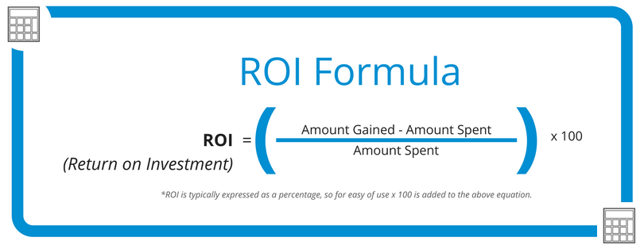

class: inverse, center, middle

# What Drives Employers to Make Hiring Decisions?

--

# ROI

---
class: inverse, center, middle

# Employer Expectations for Junior Analyst Roles

--

### Analytical skills: access, visualize, analyze, and interpret data.

--

### Technical skills: have proficiency in relevant analytics tools.

--

### Attention to detail: be able to identify inconsistencies and errors in data and fix them.

--

### Continuous Learning: have a desire and ability to continuously learn; be willing to take on new challenges and adapt to changing business needs.

--

### Teamwork: follow guidance of senior staff members; seek feedback to be more independently and take more responsibilities.

---

# Critical Analytics Tools

.pull-left[

### Excel 

- [Basics](https://www.youtube.com/watch?v=rwbho0CgEAE)
- [Commenly Used Functions](https://twitter.com/FluentInFinance/status/1608657614778564612)
- [Online Practices](https://excel-practice-online.com/)
- [Charts](https://www.youtube.com/watch?v=DAU0qqh_I-A)

### SQL

- [SQLZOO](https://sqlzoo.net/wiki/SQL_Tutorial)
- [SQL: Data Reporting and Analysis](https://www.linkedin.com/learning/sql-data-reporting-and-analysis-18082247)
- [SQL Tutorial for Data Analysis](https://mode.com/sql-tutorial/)

***

Visit [here](https://www.linkedin.com/posts/jiang-li-analytics_businessanalysis-personalgrowth-professionaldevelopment-activity-6800186575796924416-qv0E) to access LinkedIn Learning for free!

Use your Franklin email to access [OREILLY's](https://learning.oreilly.com/home/) learning resources for free!
]

.pull-right[

### Tableau

- [Training Videos](https://www.tableau.com/learn/training/20224)
- [A Good General Book for Data Visualizaton: Storytelling with Data](https://learning.oreilly.com/library/view/storytelling-with-data/9781119002253/)

### R

- [R Tutorial](https://www.w3schools.com/r/)
- [R for Data Science: read Explore, Wrangle, Communicate](https://r4ds.had.co.nz/program-intro.html)

### Python

- [pandas Essential Training](https://www.linkedin.com/learning/pandas-essential-training)

]

---

# Market Yourself

.pull-left[

### Resume 

- Customize it! Include the key works and related projects in the job description.

- Be concise. One page is OK.

- [Franklin Career Development, meet Cyndi](https://www.franklin.edu/franklin-experience/career-development)

- Resume Builders
  - [resume.io](https://resume.io/)
  - [kickresume](https://www.kickresume.com/en/)
  - [resumeai](https://www.resumai.com/)

]

.pull-right[

### LinkedIn 

- [Profile for Job Seekers](https://www.themuse.com/advice/linkedin-profile-tips)

### Online Portfolio

- [Tableau Public](https://help.tableau.com/current/pro/desktop/en-us/publish_workbooks_tableaupublic.htm)
- [R Markdown](https://www.compassred.com/data-journal/how-to-host-and-share-rmarkdown-files)
- [Google Colab](https://www.youtube.com/watch?v=6Egd-OMLLV4)
- [Kaggle Notebook](https://www.kaggle.com/docs/notebooks)

]

---

# Job Interview Process

### HR Screening: match key words; may call you to ask non-tech questions

--

### Phone/Online Interview: some tech and non-tech questions

--

### Onside Interview

- Technical assessment
- Case study
- Discuss your resume and experience
- Behavioral questions
- Company culture fit
- Questions from you

---

# Prepare Interview Questions

### Tech Questions 

- Review the [basic analytics concepts](https://jiang-li.github.io/posts/analytics_review.html)
- Search based on job role and employer online, for example:
  - [Chase Data Analyst Interview Questions](https://www.glassdoor.com/Interview/J-P-Morgan-Data-Analyst-Interview-Questions-EI_IE145.0,10_KO11,23.htm)

- Search based on skills or Tools, for example:
  - [Ten SQL Concepts You Should Know for Data Science Interviews](https://towardsdatascience.com/ten-sql-concepts-you-should-know-for-data-science-interviews-7acf3e428185)
  
**Note:** There is an easy way to see any Medium article for free. Open Twitter, go to your DMs, and DM yourself the link. Then click the link from your own DM.
--

### Non-tech Questions

- [10 must-know interview questions](https://twitter.com/FluentInFinance/status/1624182116924653572)
- [Do you have questions for me?](https://www.indeed.com/career-advice/interviewing/interview-question-do-you-have-any-questions)

---

# Attitude

## Show a strong interest for the job, the company, and the industry.

--

## Stay positive even if you face challenging questions.

--

## Don't be afraid to admit when you don't know something and show a strong willingness to learn.

---

# AI-Powered Interview Preparation

### [ChatGPT can help you turn 5x more interviews into job offers](https://twitter.com/austinbelcak/status/1630207693439762435)

### Mock Interview

#### In ChatGPT, enter the following text, replace the highlighed text as needed:

I want you to act as an interviewer from **Chase bank at Columbus Ohio**. I will be the candidate and you will ask me the interview questions for the position of **data analyst**. I want you to only reply as the interviewer. Do not write all the conservation at once. I want you to only do the interview with me. Ask me the questions and wait for my answers. Do not write explanations. Ask me the questions one by one like an interviewer does and wait for my answers. My first sentence is "Hi".

---

class: center, middle

# Any Additional Questions?

