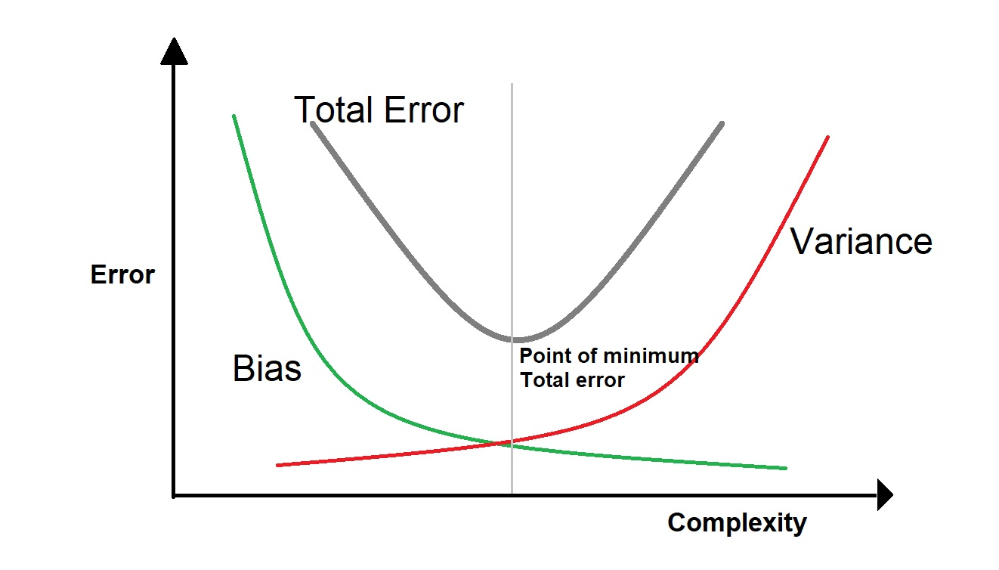

### Introduction 

Predictive modeling is about using algorithms to learn from history and make predictions for the future. The ultimate goal is to create a model that generalizes well to future data. However, in practice, it's not always easy to achieve this goal. One common challenge is overfitting. This occurs when a model is too complex, and it fits the training data too closely. As a result, it doesn't generalize well to new data. Regularization is one technique to address this problem. In this post, we'll discuss what regularization is, what it's used for, and how it works.

### Bias, Variance, and Generalization Performance 

Before we dive into regularization, it's critical to understand some key concepts in predictive modeling. One of these is bias, which means how well a model fits the training data. If a model has high bias, it often indicates it's too simple and underfits the data. Another concept is variance, which refers to how much the model's predictions vary when applied to training and test data sets. If a model has high variance, it often means it's too complex and overfits the training data. That is, the model tries to explain not only the true patterns in the population, but also the noises in the training data. Then, it works poorly as the test set noises are different. Generalization performance of a model refers to how well it performs on new, unseen data. Ideally, we want a model with low bias, low variance, and high generalization performance.

### Bias Variance Trade Off 

Models with high bias are too simple and do not capture the underlying patterns in the data, while models with high variance are overly complex and capture too much of the noise in the data. Thus, there is a trade-off between bias and variance, and finding the right balance between the two is crucial to achieving the best generalization performance. When the bias is small, the variance tends to be high, and vice versa. 

The following chart shows that we should balance the bias and variance to minimize the total error (bias + variance), so as to ensure that the model is neither too simple nor too complex and can generalize well to new data.




### What Is Regularization? 

Regularization is a technique used to prevent overfitting by adding a penalty term to the model's cost function. The cost function is a mathematical function that measures how well the model fits the training data. By adding a penalty term to the cost function, we can increase bias and decrease variance. The idea is, we want to make sure the model doesn't fit the training data too closely with a very small bias. When the bias is not that small, the variance could not be that large. Thus, the decreased variance will help us prevent overfitting and improves model generalization performance. In practice, regularization is often used in scenarios where there's a risk of overfitting. This is, for example, when there's a large number of predictors or when the data is noisy.

### L1 and L2 Regularization

L1 and L2 regularization are two of the most popular regularization techniques used in machine learning. L1 regularization (also called Lasso) adds a penalty term to the model's cost function that is proportional to the absolute value of the predictor coefficients. This shrinks some of the coefficients to exactly zero, which makes the model more interpretable and helps with predictor selection. L2 regularization (also called Ridge), on the other hand, adds a penalty term proportional to the square of the coefficients. This shrinks all coefficients, but not necessarily to zero. This can help reduce the impact of outliers in the data.

### R Example

In this demo, we will load the [Boston Housing Data Set](https://www.dataminingbook.com/content/datasets-download-r-and-python-editions) used in our Data Mining course, and predict the house pricing, MEDV, using linear regression (LR) and LR with L1 regularization.

```{r, warning=F, message=F}
df <- read.csv("./BostonHousing.csv")
head(df)
```

The data dictionary is: 

|Column  | Description |
|---------|---------------------------------------------------------------------------|
| CRIM    | Per capita crime rate by town                                             |
| ZN      | Proportion of residential land zoned for lots over 25,000 ft2             |
| INDUS   | Proportion of nonretail business acres per town                           |
| CHAS    | Charles River dummy variable (= 1 if tract bounds river; = o   otherwise) |
| NOX     | Nitric oxide concentration (parts per 10 million)                         |
| RM      | Average number of rooms per dwelling                                      |
| AGE     | Proportion of owner-occupied units built prior to 1940                    |
| DIS     | Weighted distances to five Boston employment centers                      |
| RAD     | Index of accessibility to radial highways                                 |
| TAX     | Full-value property-tax rate per $10,000                                  |
| PTRATIO | Pupil/teacher ratio by town                                               |
| LSTAT   | Percentage lower status of the population                                  |
| MEDV    | Median value of owner-occupied homes in Woos                              |


#### Split the data into 80% for training and 20% for validation. 

```{r}
n <- nrow(df)
training.index <- sample(1:n, n*0.8)

set.seed(1)
df.train  <- df[training.index, ]
df.valid <- df[-training.index, ]
```

#### Train a linear regression model

```{r}
lr <- lm(MEDV ~ ., data = df.train)
summary(lr)
```

The performances of the train and validation sets are as follows:

```{r, message=F}
library(forecast)

accuracy(predict(lr, df.train), df.train$MEDV)
accuracy(predict(lr, df.valid), df.valid$MEDV)

```

#### Train a linear regression with L1 regularization (Lasso)

First, define the response variable, y, and the matrix of predictor variables, x.


```{r}
y <- df.train$MEDV
x <- as.matrix(df.train[,-ncol(df)])
```


Next, we’ll use the glmnet() function to fit the lasso regression model and specify alpha=1. Note that setting alpha equal to 0 is equivalent to using ridge regression and setting alpha to some value between 0 and 1 is equivalent to using an elastic net, which is a mixture of lasso and ridge. 

To determine what value to use for lambda, which controls the strength of the penalty applied to the model's coefficients, we’ll perform k-fold cross-validation and identify the lambda value, that produces the lowest test mean squared error (MSE).

Note that the function cv.glmnet() automatically performs k-fold cross validation using k = 10 folds.

```{r}
library(glmnet)

#perform k-fold cross-validation to find optimal lambda value
lr.lasso.cv <- cv.glmnet(x, y, alpha = 1)

#find optimal lambda value that minimizes cross validation's test MSE
best_lambda <- lr.lasso.cv$lambda.min
best_lambda
```
Let's find coefficients of best model

```{r}
best_model <- glmnet(x, y, alpha = 1, lambda = best_lambda)
coef(best_model)
```
You will notice that the coefficients obtained in the early linear regression model are similar to those in our current lasso model. However, it is important to highlight that the coefficient for the predictor variable "INDUS" and "AGE" were found to be zero and therefore it was removed from the model. When dealing with a large number of predictors, Lasso regression is a valuable technique for selecting the most relevant predictors.

We also can check the performance of this lasso model:

```{r, message=F}
pred.train <- as.vector(predict(best_model, s = best_lambda, newx = x))
valid_x <- as.matrix(df.valid[,-ncol(df)])
pred.valid <- as.vector(predict(best_model, s = best_lambda, newx = valid_x))

accuracy(pred.train, df.train$MEDV)
accuracy(pred.valid, df.valid$MEDV)

```
The validation performance appears to show a slight improvement after applying L1 regularization. However, note that a more significant enhancement in generalization performance is usually observed when dealing with more complex data.

### Conclusion 

Regularization is a powerful technique that can prevent overfitting and improve model generalization performance. By introducing bias, we can encourage the model to have smaller coefficients, which makes it less complex and less likely to overfit. L1 and L2 regularization are two of the most common regularization types, and they have different strengths and weaknesses.

L1 and L2 regularization can be applied to many machine learning algorithms, such as linear regression, logistic regression, support vector machines, and neural networks, among others.

