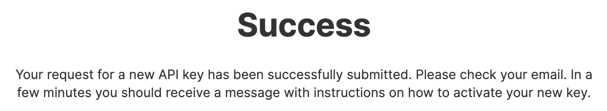
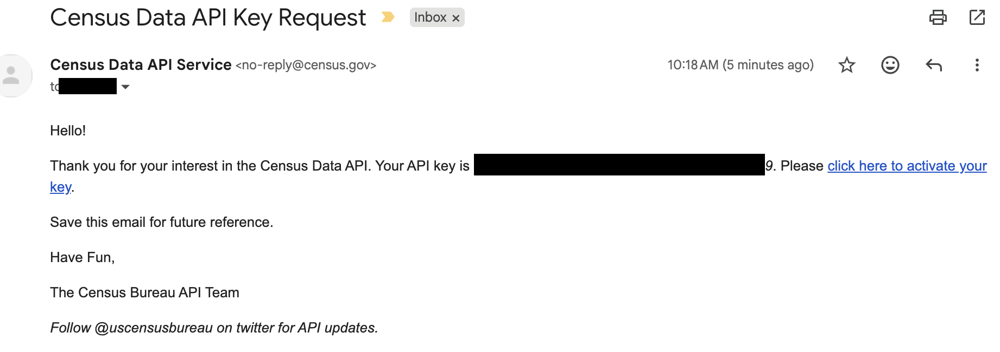
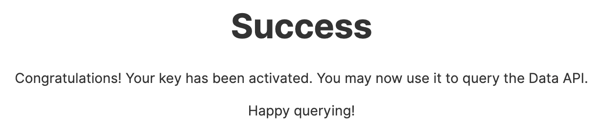
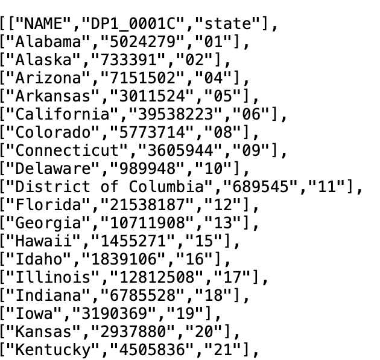

<style>
.step-screenshot {
  width: 100% !important;
  max-width: 700px;
}
</style>

::: {.callout-note}
## Why This Matters Now
As of **May 2026**, the Census Bureau requires an API key for *every* Census Data API request — previously a key was only needed for high-volume use. If you're working with Census data for a class project this term, you now need a key before you can pull anything.
:::

Good news: it's free, takes about 5 minutes, and there's no special student or institutional requirement — any email ending in `.com`, `.net`, `.org`, `.gov`, or `.edu` works fine.

## Step 1: Go to the Signup Form

Visit **[api.census.gov/data/key_signup.html](https://api.census.gov/data/key_signup.html)** and fill in:

- **Organization Name** — e.g. your university or program name
- **Email Address** — any standard email works
- Check **"I agree to the terms of service"**
- Click **Request Key**

You'll immediately see a confirmation page:

{.step-screenshot}

## Step 2: Check Your Email

Within a few minutes, you'll receive an email from the Census Data API Service with the subject line **"Census Data API Key Request"**. It contains your 40-character key and an activation link.

{.step-screenshot}

**Your key does nothing until you click that activation link.**

::: {.callout-warning}
## If You're Using a School Email
If you check this email through an institutional inbox (Office 365, Proofpoint, Mimecast, etc.), the security scanner sometimes **rewrites the activation link**, which can throw an "unknown key" error when clicked. If that happens:

1. Right-click the activation link → **Copy Link Address**
2. Paste it into a text editor
3. Find the real `https://api.census.gov/...` URL embedded inside the longer, rewritten one
4. Paste that original URL into your browser instead

This is the single most common snag students run into — a personal Gmail or other non-institutional address avoids it entirely, which is why it's a good fallback if the school email keeps failing.
:::

## Step 3: Activate the Key

Click the activation link (or the extracted original URL). You should land on a confirmation page:

{.step-screenshot}

## Step 4: Test the Key

Paste this URL into your browser, replacing `YOUR_KEY` with your actual key:

```
https://api.census.gov/data/2020/dec/dp?get=NAME,DP1_0001C&for=state:*&key=YOUR_KEY
```

You should get back state-by-state population data, starting with Alabama:



If it doesn't work right away, wait a few minutes — activation can take a moment to fully propagate. If it's still failing after that, request a new key with a different email address rather than troubleshooting the same one indefinitely.

## Keep Your Key Private

Treat your API key like a password:

- Don't commit it to GitHub or share it in code you post publicly
- If you're sharing a notebook or script, replace your real key with a placeholder like `YOUR_KEY_HERE`
- Save the confirmation email — it's the only place your key is shown in full
