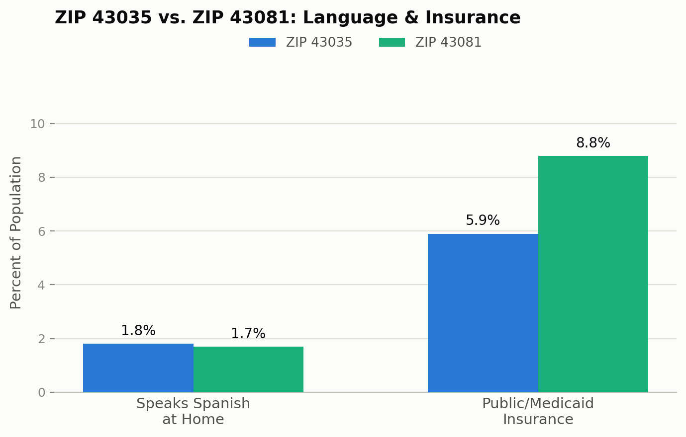

<style>
.step-screenshot {
  width: 100% !important;
  max-width: 700px;
}
</style>

::: {.callout-note}
## Prerequisite
This guide assumes you already have an activated Census API key. If not, start with **[How to Get a U.S. Census Bureau API Key](../census-api-key/)** first.
:::

This is a Python translation of a common R workflow: pulling American Community Survey (ACS) data for a ZIP code and computing percentages — for example, **% of residents who speak Spanish at home** and **% with public/Medicaid health insurance coverage**.

The example below compares two individual ZIP codes. Real projects often group several ZIP codes into custom zones (a school's enrollment area, a sales territory) — but that grouping logic is a business decision specific to your project, not something a general-purpose tutorial should bake in. Once you can pull and compare two ZIP codes, extending this to grouped zones is a matter of adding your own `groupby()` on top.

## Which Package Should You Use?

In R, `tidycensus` makes this quick. Two Python options were tested directly against the live Census API before writing this guide:

- **`pytidycensus`** (the direct port of `tidycensus`) — its ZIP-filtering option **silently ignores the ZIP list and downloads all ~33,800 ZCTAs nationwide** every time, regardless of what you ask for. Not usable for this task.
- **`censusdis`** — correctly filters to just the ZIP codes you request, returns an already-numeric DataFrame, and needs only one function call to fetch data. **This is what the rest of this guide uses.**

```
pip install censusdis pandas matplotlib
```

::: {.callout-tip collapse="true"}
## No Package? A Raw-API Alternative
If `censusdis` won't install in your environment (its dependency chain — geopandas, Fiona, contextily — can sometimes conflict with other packages in a shared environment like Kaggle), you can hit the Census API directly with `requests` instead. It's more code, since you're doing by hand what the package normally does for you: building the query URL, parsing the raw JSON response, and converting every column from text to numbers.

```python
import requests

codes = list(variables.values())
url = "https://api.census.gov/data/2022/acs/acs5"
params = {
    "get": ",".join(["NAME"] + codes),
    "for": f"zip code tabulation area:{','.join(zips)}",
    "key": API_KEY,
}
data = requests.get(url, params=params).json()

df = pd.DataFrame(data[1:], columns=data[0])
df = df.rename(columns={v: k for k, v in variables.items()})
for col in variables:
    df[col] = pd.to_numeric(df[col])
```

Everything after this point (computing percentages, charting) works identically either way.
:::

## Step 1: Define Your ZIP Codes and Variables

Pick the ZIP codes you want to compare, and map readable names to ACS variable IDs:

```python
import censusdis.data as ced
import pandas as pd

API_KEY = "YOUR_KEY_HERE"

zips = ["43035", "43081"]

# ACS 5-Year variable codes
variables = {
    "total_pop":       "B01003_001E",  # Total population
    "female_pop":      "B01001_026E",  # Female population
    "median_age":      "B01002_001E",  # Median age
    "edu_total":       "B15003_001E",  # Population 25+ (education universe)
    "edu_bachelors":   "B15003_022E",
    "edu_masters":     "B15003_023E",
    "edu_prof":        "B15003_024E",
    "edu_doc":         "B15003_025E",
    "race_total":      "B03003_001E",  # Hispanic-origin universe
    "hispanic":        "B03003_003E",  # Hispanic or Latino
    "lang_total":      "C16001_001E",  # Population 5+ (language universe)
    "lang_spanish":    "C16001_003E",  # Speaks Spanish at home
    "medicaid_m_u19":  "C27007_004E",  # Medicaid: Male, under 19
    "medicaid_m_19_64":"C27007_007E",  # Medicaid: Male, 19-64
    "medicaid_m_65":   "C27007_010E",  # Medicaid: Male, 65+
    "medicaid_f_u19":  "C27007_014E",  # Medicaid: Female, under 19
    "medicaid_f_19_64":"C27007_017E",  # Medicaid: Female, 19-64
    "medicaid_f_65":   "C27007_020E",  # Medicaid: Female, 65+
}
```

::: {.callout-warning}
## Double-Check Language Codes Before You Reuse Them
Table `C16001` is easy to get wrong: `C16001_002E` is **"Speak only English"** — the exact opposite of what you want. The Spanish-speaker count is `C16001_003E`. Always verify a variable's label at `api.census.gov/data/2022/acs/acs5/variables/<CODE>.json` before trusting it, especially for tables with many similar-looking rows.
:::

## Step 2: Fetch the Data

One function call fetches exactly the ZIP codes and variables you asked for, already as numeric columns — no query-building or JSON-parsing required:

```python
df = ced.download(
    dataset="acs/acs5",
    vintage=2022,
    download_variables=["NAME"] + list(variables.values()),
    api_key=API_KEY,
    zip_code_tabulation_area=zips,
)

# Rename columns from ACS codes back to readable names
df = df.rename(columns={v: k for k, v in variables.items()})
```

This returns one row per ZIP code — no grouping or aggregation needed, since you're comparing individual ZIPs directly.

## Step 3: Compute Percentages

Combine sub-fields (like the six Medicaid age/sex cells) and compute each percentage directly, row by row:

```python
df["total_ba_plus"] = (
    df["edu_bachelors"] + df["edu_masters"] + df["edu_prof"] + df["edu_doc"]
)
df["total_medicaid"] = (
    df["medicaid_m_u19"] + df["medicaid_m_19_64"] + df["medicaid_m_65"]
    + df["medicaid_f_u19"] + df["medicaid_f_19_64"] + df["medicaid_f_65"]
)

df["Pct_Female"]            = df["female_pop"] / df["total_pop"] * 100
df["Pct_Hispanic"]          = df["hispanic"] / df["race_total"] * 100
df["Pct_Spanish_Speaker"]   = df["lang_spanish"] / df["lang_total"] * 100
df["Pct_Bachelors_Plus"]    = df["total_ba_plus"] / df["edu_total"] * 100
df["Pct_Medicaid_Coverage"] = df["total_medicaid"] / df["total_pop"] * 100

result = df[["ZIP_CODE_TABULATION_AREA", "total_pop", "median_age", "Pct_Female",
             "Pct_Hispanic", "Pct_Spanish_Speaker", "Pct_Bachelors_Plus",
             "Pct_Medicaid_Coverage"]].round(1)

print(result.to_string(index=False))
```

::: {.callout-tip}
## A Simpler Alternative for Medicaid
Summing six age/sex cells from table `C27007` is the most precise way to isolate Medicaid specifically. If you just need a general "public coverage" percentage (Medicaid + Medicare + VA + other public programs combined) and don't need the Medicaid-only breakdown, the Data Profile variable **`DP03_0098PE`** gives you a pre-computed percentage directly — no summing or division required. Trade precision for simplicity depending on what your analysis needs.
:::

## Expected Output

Running the code above against the 2022 ACS 5-year release should produce this table — run it yourself and compare:

| ZIP_CODE_TABULATION_AREA | total_pop | median_age | Pct_Female | Pct_Hispanic | Pct_Spanish_Speaker | Pct_Bachelors_Plus | Pct_Medicaid_Coverage |
|:---|---:|---:|---:|---:|---:|---:|---:|
| 43035 | 34661 | 35.2 | 50.7 | 3.3 | 1.8 | 65.5 | 5.9 |
| 43081 | 64746 | 35.9 | 52.6 | 3.1 | 1.7 | 54.5 | 8.8 |

And the two headline metrics from this tutorial, visualized:

```python
import matplotlib.pyplot as plt

metrics = ["Pct_Spanish_Speaker", "Pct_Medicaid_Coverage"]
labels = ["Speaks Spanish\nat Home", "Public/Medicaid\nInsurance"]

zip1, zip2 = df["ZIP_CODE_TABULATION_AREA"].tolist()
vals1 = df[df["ZIP_CODE_TABULATION_AREA"] == zip1][metrics].values.flatten()
vals2 = df[df["ZIP_CODE_TABULATION_AREA"] == zip2][metrics].values.flatten()

x = range(len(metrics))
width = 0.32
fig, ax = plt.subplots(figsize=(7, 4.5))
ax.bar([i - width/2 for i in x], vals1, width, label=f"ZIP {zip1}", color="#2a78d6")
ax.bar([i + width/2 for i in x], vals2, width, label=f"ZIP {zip2}", color="#1baf7a")
ax.set_xticks(list(x))
ax.set_xticklabels(labels)
ax.set_ylabel("Percent of Population")
ax.legend()
plt.show()
```

{.step-screenshot}

If your numbers don't match: confirm you're pulling the same `vintage` (2022) — ACS estimates shift slightly with each annual data release.

## Full Script

Putting it all together:

```python
import censusdis.data as ced
import pandas as pd
import matplotlib.pyplot as plt

API_KEY = "YOUR_KEY_HERE"

zips = ["43035", "43081"]

variables = {
    "total_pop": "B01003_001E", "female_pop": "B01001_026E",
    "median_age": "B01002_001E", "edu_total": "B15003_001E",
    "edu_bachelors": "B15003_022E", "edu_masters": "B15003_023E",
    "edu_prof": "B15003_024E", "edu_doc": "B15003_025E",
    "race_total": "B03003_001E", "hispanic": "B03003_003E",
    "lang_total": "C16001_001E", "lang_spanish": "C16001_003E",
    "medicaid_m_u19": "C27007_004E", "medicaid_m_19_64": "C27007_007E",
    "medicaid_m_65": "C27007_010E", "medicaid_f_u19": "C27007_014E",
    "medicaid_f_19_64": "C27007_017E", "medicaid_f_65": "C27007_020E",
}

df = ced.download(
    dataset="acs/acs5",
    vintage=2022,
    download_variables=["NAME"] + list(variables.values()),
    api_key=API_KEY,
    zip_code_tabulation_area=zips,
)
df = df.rename(columns={v: k for k, v in variables.items()})

df["total_ba_plus"] = df["edu_bachelors"] + df["edu_masters"] + df["edu_prof"] + df["edu_doc"]
df["total_medicaid"] = (
    df["medicaid_m_u19"] + df["medicaid_m_19_64"] + df["medicaid_m_65"]
    + df["medicaid_f_u19"] + df["medicaid_f_19_64"] + df["medicaid_f_65"]
)

df["Pct_Female"] = df["female_pop"] / df["total_pop"] * 100
df["Pct_Hispanic"] = df["hispanic"] / df["race_total"] * 100
df["Pct_Spanish_Speaker"] = df["lang_spanish"] / df["lang_total"] * 100
df["Pct_Bachelors_Plus"] = df["total_ba_plus"] / df["edu_total"] * 100
df["Pct_Medicaid_Coverage"] = df["total_medicaid"] / df["total_pop"] * 100

result = df[["ZIP_CODE_TABULATION_AREA", "total_pop", "median_age", "Pct_Female",
             "Pct_Hispanic", "Pct_Spanish_Speaker", "Pct_Bachelors_Plus",
             "Pct_Medicaid_Coverage"]].round(1)

print(result.to_string(index=False))
```

## Keep Your Key Private

Same rule as always: don't hardcode your API key in a notebook you'll share or push to GitHub. Read it from an environment variable instead:

```python
import os
API_KEY = os.environ["CENSUS_API_KEY"]
```
